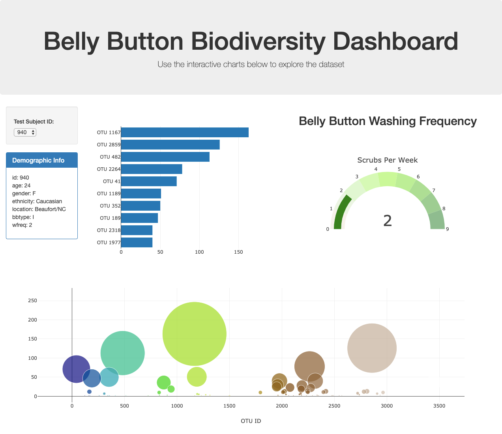

# plotly-challenge

This **JavaScript**-based dashboard is based on a real study of microbes found in [human belly buttons](http://robdunnlab.com/projects/belly-button-biodiversity/). A combination of **[D3](https://d3js.org/)** and **[Plotly](https://plot.ly/javascript/)** were used to read a JSON file and update four sections using a dropdown menu: 1. demographic table, 2. horizontal bar chart of microbes, 3. gauge chart of scrubs per week, and 4. bubble chart of microbes. 

### Live Website:
[https://ellemonke.github.io/plotly-challenge/](https://ellemonke.github.io/plotly-challenge/)

### Screenshot:

